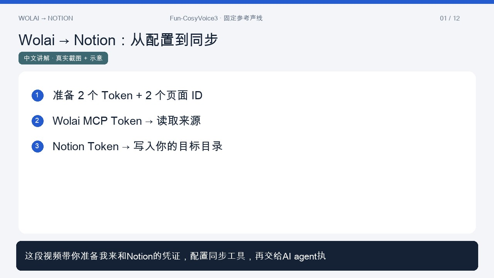

# Wolai → Notion Sync

[English](README.en.md) · [视频教程](tutorial/README.md) · [给 AI 的即用提示词](docs/ai-quickstart.md) · [安全说明](SECURITY.md) · [迁移与定时运行](docs/operations.md)

一个本地优先、单向、保留多层级关系的 Wolai（我来）到 Notion 同步工具。适合希望把指定笔记目录及其任意层级子页镜像到 Notion 的个人使用者。

本项目是社区工具，与 Wolai、Notion 无隶属关系。不需要 Codex、浏览器、macOS 钥匙串或特定个人账号。你使用自己的账号、凭证和目标目录，项目不内置任何人的笔记。

想交给 AI agent 使用？复制 [AI 快速使用指南](docs/ai-quickstart.md) 中的完整提示词，填写项目路径和两端根页面 ID；本地安全配置凭证后，agent 可按现有 CLI 完成初始化、检查、预览、分批同步与验收。

## 中文视频教程

[](https://d1.music.126.net/dmusic/35bf/351c/7ed5/ccb22e35a81a28a49529bf5f67aeacbd.mp4?infoId=4482506)

[在线观看 / 下载视频](https://d1.music.126.net/dmusic/35bf/351c/7ed5/ccb22e35a81a28a49529bf5f67aeacbd.mp4?infoId=4482506) · 中文讲解，约 3 分 41 秒。包含凭证配置、初始化、同步与验收示意；[章节和字幕](tutorial/README.md)。

## 能做什么

| 能力 | 行为与边界 |
| --- | --- |
| 多层级目录 | 逐页递归读取完整块，父页先于子页；保留真实父级与源端同级顺序 |
| 每日增量 | 每次完整扫描指定子树；同时比较版本与正文指纹，不因父页版本未变而跳过后代 |
| 图片与附件 | 下载并上传至 Notion，写入后核对数量；ZIP 原件和验收抽样会比对字节指纹 |
| 深层正文 | 原生块分批写入并逐层补齐，避免接口两层打包限制遗漏更深内容 |
| 文本与代码 | 保留代码、字面量编号和嵌套列表；不通过 Markdown 往返来排序目录 |
| 失败续传 | 本地保存映射、来源指纹、成功版本及恢复日志；失败不推进成功版本 |
| 手工内容保护 | 目标正文、标题、父级有差异时保留现场，不强制覆盖或重设基线 |
| 页面图标 | 标题含 `idea` 时用 💡，日期标题用 📅；已有自选图标保留，可通过配置关闭 |
| 不删除源与目标页面 | Wolai 只读；源页消失不会触发 Notion 页面删除 |

### 必须如实理解的例外

- 数据库只保留容器/来源入口；**不枚举或复制完整数据库记录、字段和视图**。
- 超出上传上限的文件只保留 Wolai 来源链接，不压缩冒充成功复制。
- 不支持的编辑器原件可以作为 **ZIP 原件附件** 保存；它不是可直接编辑的原生绘图文件。
- 接口内容网关持续拒绝的极少数新页可能改为 **整页 ZIP 原文存档**，不是内联正文。
- 模板按钮、部分书签、空媒体和未支持块可能降级并记录格式警告。
- 不复制评论、权限、共享设置、版本历史及所有平台特有交互。
- `verify` 核对所有页面的来源、父级、目标基线、独立正文覆盖、媒体数量和目录顺序，并对最多 3 个媒体页抽核字节；**不代表所有媒体都做了字节级全量验收**。

同步结果中的 `mediaExceptions`、`mediaArchives`、`archivePages` 及验收报告的 `exceptions` 分别记录这些情况。同步完成不等于无例外；`remaining=0` 也不能代替 `orderRemaining=0` 和 `navigationComplete=true`。

## 环境和依赖

- Node.js **22.19 或更新版本**，推荐受支持的 LTS；npm。
- 一个可读取你指定页面的 **Wolai MCP Token**，官方 MCP 端点为 `https://api.wolai.com/v1/mcp`。
- 一个有目标目录读取、插入、更新权限的 **Notion Token**。
- 网络能访问 Wolai MCP、源媒体地址以及 Notion API。可使用标准代理环境变量。
- 唯一运行时 npm 依赖是锁定版本的 `undici`；测试使用 Node 内置测试框架，ZIP 写入使用本项目代码。

Notion 请求固定使用 `2026-03-11` API 版本，需要 Markdown 内容与页面移动接口可用。认证方式见 [Notion 官方授权说明](https://developers.notion.com/guides/get-started/authorization)，接口见 [Markdown 读取](https://developers.notion.com/reference/retrieve-page-markdown) 和 [页面移动](https://developers.notion.com/reference/move-page)。Wolai 接入能力/权益以其当前客户端设置为准。

## 快速开始

### 1. 获取代码、安装依赖

下载本项目或克隆你发布的仓库，然后在工程目录执行：

```sh
npm ci
node bin/cli.mjs --help
```

此工程可直接在 macOS、Linux 或 Windows 的 Node 环境中运行，不需要全局安装 CLI。`npm install -g .` 可安装 `wolai-notion-sync` 命令，但不是必需步骤。

### 2. 准备自己的目标页面和凭证

建议在 Notion **新建一个空的导出根页面**，避免与已有手工内容混在一起。使用内部连接时，把该页面及其后代共享给连接并启用读取/插入/更新内容能力。也可以使用自己的 PAT；PAT 权限通常较广，优先考虑最小授权范围。

在 Wolai 的个人设置中启用 MCP 接入并创建自己的 Token。不要把 Token 发到公开 Issue、聊天、截图或仓库中。

复制 `.env.example` 为本地 `.env`，使用本地编辑器填入：

```dotenv
WOLAI_MCP_TOKEN=你的Wolai凭证
NOTION_TOKEN=你的Notion凭证
```

这只是说明格式，不是真实凭证。`.env` 被 Git 排除；CLI 不保存凭证、不读取其他应用配置。也可由系统环境或秘密管理工具提供变量。共享工程时不要共享已填写的 `.env`。

macOS/Linux 建议将本地凭证文件设为仅自己可读（例如 `chmod 600 .env`）；Windows 请设置相应用户 ACL。

### 3. 初始化一个独立的数据目录

```sh
node bin/cli.mjs init --source-root YOUR_WOLAI_PAGE_ID --notion-root YOUR_NOTION_PAGE_ID
```

把两处参数换成自己的 **页面 ID**，不是整条 URL。Notion ID 可以是 32 位十六进制或带连字符的 UUID；Wolai ID 来自页面链接。可重复 `--source-root` 选择多个目录，避免选择互相嵌套的根。

多个选定根会并列出现在导出根下；每个根内部保留源目录顺序，不复现未选择的上层目录。

默认生成当前工作目录下的 `.wolai-notion-sync/`，里面是你的私人配置与运行数据。初始化不会访问远端、创建 Notion 页面或覆盖已有状态。所有命令均支持 `--data-dir /path/to/private-data`，可把数据放到工程以外。

### 4. 检查连接，再预览计划

```sh
node --env-file=.env bin/cli.mjs check
node --env-file=.env bin/cli.mjs check --remote
node --env-file=.env bin/cli.mjs sync
```

`check --remote` 只读取权限和接口能力，**不通过实际写入来测试写权限**。`sync` 未加 `--apply` 时只读取 Wolai、保存本地扫描缓存、输出计划；不会写入 Notion。

### 5. 执行同步

```sh
node --env-file=.env bin/cli.mjs sync --apply
node bin/cli.mjs status
```

默认每批最多 50 个正文/目录操作。首次数据较多时，需要继续分批：

```sh
node --env-file=.env bin/cli.mjs sync --apply --resume
```

`--resume` 仅使用 24 小时内的完整快照；日常运行不加该参数，以重新发现所有新增与修改。发现“源页面已变化、等待重新扫描”时，去掉 `--resume` 刷新快照，不继续重试旧缓存。

目录排序可能暂时把受管子页移到**同一个授权根页面**再放回，操作前持久化恢复日志，不删除页面。中断后在同一数据目录续传，不手工清除 `pendingOrderMove` 或 `pendingStructureRepair`。

### 6. 验收

最新扫描的正文和目录全部对齐后运行：

```sh
node --env-file=.env bin/cli.mjs verify
```

这是只读远端验收，不会通过重写正文“修复”差异。报告保存到私人数据目录的 `reports/full-tree-verification.json`。只有报告中的 `accepted=true` 才表示本次检查通过；数据库和媒体例外仍须单独查看。

## 配置与退出码

配置为私人数据目录内的 `sync-config.json`，模板见 [examples/sync-config.example.json](examples/sync-config.example.json)。

- `syncScope.sourceRootIds`：必须显式指定，不能留空或退回全库扫描。
- `notionRoot.pageId`：唯一目标根；更换来源范围或目标必须新建数据目录，防止串库。
- `policy.batchSize`：1–500，默认 50；`--limit` 可调整一次运行的额度。
- `media.maxFileUploadBytes`：默认 5 MiB，上限 20 MiB；还受 Notion 实际工作区能力限制。
- `appearance.ideaIcon` / `datedLogIcon`：设为 `""` 可以关闭相应图标规则。
- 不接受关闭手工保护或源缺失时删除目标的配置，不提供 `--force`。

| 退出码 | 意义 |
| --- | --- |
| `0` | 命令成功；`sync --apply` 的本次待处理和目录剩余均为零，但仍可能有已记录的媒体/格式例外 |
| `2` | 失败、保护冲突、停止、配置错误或验收未通过；保留现场，不当作成功 |
| `3` | 本批正常结束，但仍有正文或目录等待下一批；不是整库完成 |

日志默认只给计数/错误分类，不打印笔记正文或凭证。状态、缓存和详细报告仍含私人标题、ID、原文或签名地址，**不应公开**。

## 定时运行与换电脑

本项目不依赖聊天自动化。可用 cron、systemd、macOS 定时服务或 Windows 任务计划程序运行 `sync --apply`。示例脚本和迁移步骤见 [运行手册](docs/operations.md)。

只启用**一个写入同一目标的设备**。本地锁不提供跨设备分布式互斥。换设备时，先停止旧定时任务，再私下迁移完整运行数据、在新设备自行配置凭证并核对绑定；不同用户应使用各自的账号、根页面和数据目录。

## 参与贡献

开发与测试步骤见 [贡献指南](CONTRIBUTING.md)，实现原理见 [架构说明](docs/architecture.md)。

本工具在你自己的设备上运行，不提供托管服务或 OAuth 安装；第三方 API 和权限策略变化可能影响兼容性。

## 许可证

[MIT](LICENSE)。请保留依赖声明；Wolai 与 Notion 的产品/服务使用仍受其各自条款约束。
